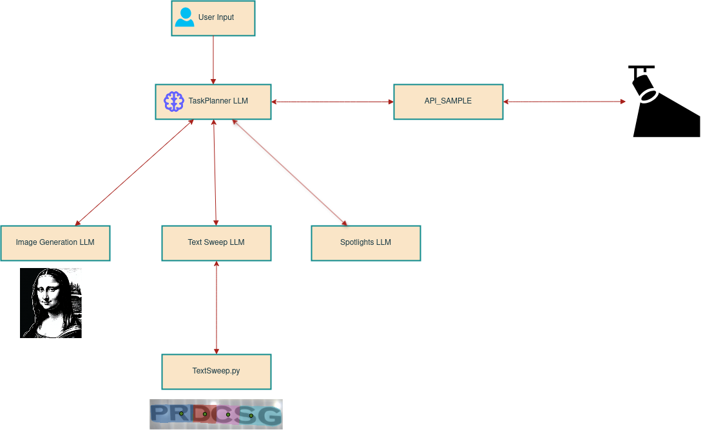

# Natural Language Commands - MicroLED

## Environment Setup


Our application should be able to run on any modern Python version **≥ 3.8**. However, we **recommend using Python 3.9** for the best compatibility.


#### 🏃💨 Quick Setup: Using `lazy_setup.sh`

For an automated setup, simply run the following script inside the main folder (NL_Microled):

```bash
$ bash lazy_setup.sh
```

This script will:
- **Install pyenv** if you don't have it already.
- **Install Python 3.9** if you don't have it.
- **Create a virtual environment** named `microled`.
- **Install all dependencies** from `requirements.txt`.
- **Create an env file**
- **Run** `app.py`.

Once the script has finished, Please populate the env file with the appropriate tokens. 


####  Alternative Setup: Incase `lazy_setup.sh` doesnt work

To get our app to work , you can install python 3.9 using any environment manager of your choice. Then kindly proceed to install all the requirements inside the main folder : 

```bash
$ pip install -r requirements.txt
```

Then please create an .env file and populate it as shown below :

```plaintext
# API token for Hugging Face
HUGGINGFACEHUB_API_TOKEN=<Add your token here>

# API key for OpenAI
OPENAI_API_KEY=<Add your token here>
```
 

After this simply run our model using : 


```bash
$ python app.py
```

⚠️ Important: Handle Proxy Settings Before Installation. If you're behind a **corporate proxy**, you may encounter issues when trying to install packages. Most importantly :

- **Git** (for cloning repositories)
- **PIP** (for installing Python packages)
- **APT** (for system package installations)


## 🚀 Simple tutorial : A simple tutorial on how to get started

#### 1️⃣ Callibration 

If callibration is not yet done for the microled you will be prompted to callibrate with :

```bash
⚠️ No previous calibration found. Running calibration now...
```
If calibrations is already done , you will have a choice to recalibrate. You will be prompted with

```bash
⚠️ Calibration is already done. Do you want to recalibrate? (Yes/No): 
```

To calibrate , simply choose the 4 edge points on the microled net image based on your camera input. Do so in a clockwise or counter clockwise manner.

<p align="center">
  
</p>


#### 2️⃣ Natural language commands for microled.

Once the microled has been effectively callibrated, you can talk to the LLMs naturally to get the microled to do specific tasks. As of right now the tasks are limited as this product is still being developed. 

You will be prompted with : 

```bash
This is a MicroLED Demo.
            It makes use of multiagent LLM to produce desired lighting effects.
            Current available effects are:
                1, Image Generation
                2, Text Sweep
                3, Text Reveal
            User:
```

Here are some of the basic commands you can ask the microled to do. : 

#### 🔹 **Basic Commands**
| Command | Description |
|---------|------------|
| `Do a text sweep.` | Using a thin line , traces the text on the canvas. |
| `Slowly reveal the words on my canvas.` | Slowly reveals the full text on the canvas. |
| `Clear my canvas` | Removes all tracing and all images from the microled |
| `Add an image of a lion to the left of the screen.` | Adds an AI image to the appropriate location on the canvas. |

The LLM is also able to understand complex multi step tasks , so it is easier for the user to use more than one functionality of the microled at a time.
Below are some exaples of commands you can use 

#### 🔹 **Advanced Commands**
| Command | Description |
|---------|------------|
| `Add an image of a monalisa to the right side of the screen. And slowly reveal the words in my canvas.` | Will create an AI generated image of the mona lisa to the right side of the screen and Slowly reveals the full text on the canvas. |
| `Do a text sweep on my text but at a vigirous pace.` | Using a thin line , traces the text on the canvas. However will do it at a fast pace this time. |
| `Clear my canvas, then add an image of a cat on the left side, holding a sign saying Hello! ` | Will clear the canvas and create the appropriate AI image on the left side of the screen. |
| `Add a sakura flower on the screen but make it very big, also do a text sweep` | Adds an AI image to the appropriate location on the canvas and then proceeds to use a thin line to trace the text on the canvas. |


## Workflow Diagram

<p align="center">
  
</p>


## 📂 Project structre


```bash

NL_Microled/
│── app.py                  # Main application entry point
│── lazy_setup.sh           # Automated setup script
│── requirements.txt        # List of dependencies
│── agents/                 # Core AI Agents
│   ├── agents ...           
│   ├── temp_storage/       # Temporary files and images , acts as database for the application.
│── api/                 
│   ├── API_Sample          # Api that sends data to the microled.
│── documents/              # Documentation and diagrams (workflow png and pdfs of the code.)
│── README.md               
```